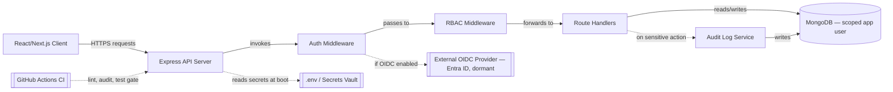

# Graph 01 — System Architecture

## Diagram



## Adjacency List (agent-parseable)

```
NODES:
  Client, API, AuthMiddleware, RBACMiddleware, RouteHandlers,
  AuditService, MongoDB, SecretsVault, OIDCProvider[external], CIPipeline[external]

EDGES:
  Client        --calls-->        API
  API           --invokes-->      AuthMiddleware
  AuthMiddleware --forwards-->    RBACMiddleware
  RBACMiddleware --forwards-->    RouteHandlers
  RouteHandlers  --reads/writes-> MongoDB
  RouteHandlers  --emits-->       AuditService        [condition: sensitive action]
  AuditService   --writes-->      MongoDB
  API            --reads-->       SecretsVault         [at boot only]
  AuthMiddleware --delegates-->   OIDCProvider         [condition: authProvider=oidc, currently disabled]
  CIPipeline     --gates-->       API                  [pre-merge only]
```

## Agent instructions for this graph

- No component may call `MongoDB` directly except through `RouteHandlers` or `AuditService`.
- `SecretsVault` is read-only at process boot — no component reads it per-request.
- `OIDCProvider` edge is dormant; do not implement it unless explicitly asked to activate OIDC mode.
- Any new node/edge proposed by the agent must be stated explicitly before code is written.
