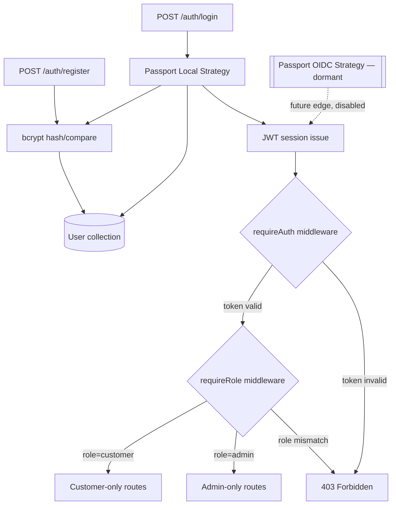

# Graph 02 — Auth & RBAC Flow

## Diagram



## Adjacency List

```
NODES:
  RegisterRoute, LoginRoute, PassportLocalStrategy, PassportOIDCStrategy[dormant],
  BcryptHash, UserModel, JWTIssuer, RequireAuthMW, RequireRoleMW,
  CustomerRoutes, AdminRoutes, Deny403

EDGES:
  RegisterRoute        --calls-->      BcryptHash
  BcryptHash           --writes-->     UserModel
  LoginRoute           --calls-->      PassportLocalStrategy
  PassportLocalStrategy --calls-->     BcryptHash            [compare mode]
  PassportLocalStrategy --reads-->     UserModel
  PassportLocalStrategy --issues-->    JWTIssuer
  JWTIssuer            --validated-by--> RequireAuthMW
  RequireAuthMW         --guards-->    RequireRoleMW          [condition: token valid]
  RequireAuthMW         --guards-->    Deny403                [condition: token invalid]
  RequireRoleMW         --guards-->    CustomerRoutes         [condition: role=customer]
  RequireRoleMW         --guards-->    AdminRoutes            [condition: role=admin]
  RequireRoleMW         --guards-->    Deny403                [condition: role mismatch]
  PassportOIDCStrategy  --issues-->    JWTIssuer              [dormant, config-flag gated]
```

## Agent instructions for this graph

- `RequireAuthMW` must run before `RequireRoleMW` on every guarded route — never the reverse.
- `AdminRoutes` must never be reachable without passing both `RequireAuthMW` and `RequireRoleMW`.
- Do not write plaintext passwords anywhere on this graph — `BcryptHash` is the only node touching raw password strings, and only in-memory, never logged or persisted.
- If asked to "add Entra ID login," the correct change is enabling `PassportOIDCStrategy` and setting its config edge active — not creating a second, parallel auth system.
