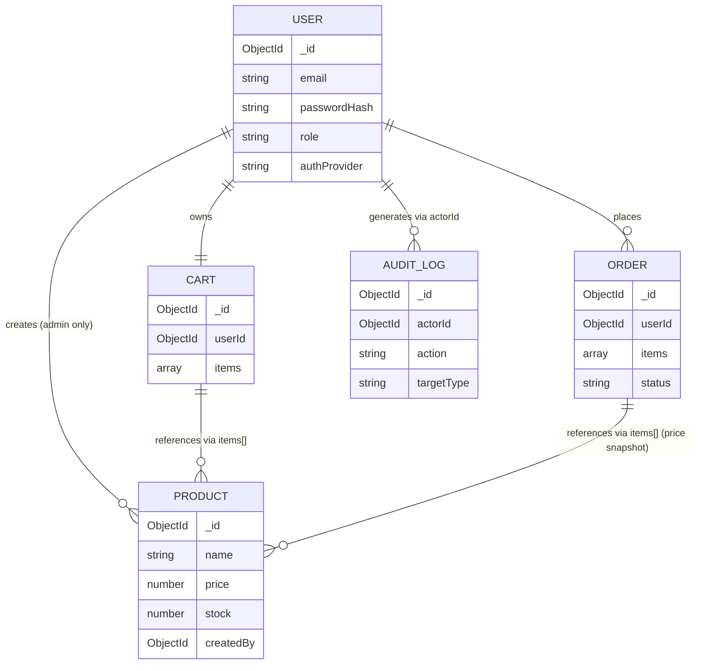

# Graph 03 — Data Model (Entity Relationship)

## Diagram



## Adjacency List

```
NODES: User, Product, Cart, Order, AuditLog

EDGES:
  User    --creates-->   Product     [condition: role=admin]
  User    --owns-->      Cart        [1:1]
  User    --places-->    Order       [1:many]
  Cart    --references-> Product     [via items[].productId, many:many]
  Order   --references-> Product     [via items[].productId, snapshots price at purchase]
  User    --generates--> AuditLog    [via actorId, many:many across action types]
```

## Agent instructions for this graph

- `Order.items[].priceAtPurchase` is a **snapshot** — never a live join to `Product.price`. If price changes after an order is placed, historical orders must not change.
- `Cart` is 1:1 with `User` — do not model multiple carts per user in this version.
- Any write to `Product`, `Order.status`, or `User.role` must produce a corresponding `AuditLog` edge (see Graph 05).
- Do not add a direct edge between `Cart` and `Order` — the conversion is a route-level operation (`POST /orders`), not a data relationship.
