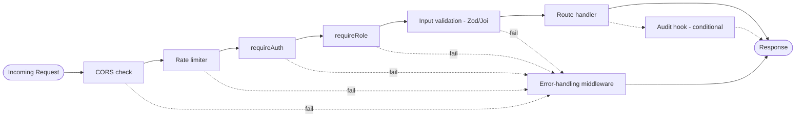

# Graph 04 — Request Lifecycle (Middleware Chain)

## Diagram



## Adjacency List

```
NODES: IncomingRequest, CORSCheck, RateLimiter, RequireAuthMW, RequireRoleMW,
       InputValidation, RouteHandler, AuditHook, ErrorMiddleware, Response

EDGES (happy path):
  IncomingRequest --> CORSCheck --> RateLimiter --> RequireAuthMW
    --> RequireRoleMW --> InputValidation --> RouteHandler --> Response

EDGES (conditional):
  RouteHandler --emits--> AuditHook   [condition: action in sensitive-action list]
  AuditHook    --> Response

EDGES (failure, every gate short-circuits to ErrorMiddleware):
  CORSCheck        --fails--> ErrorMiddleware
  RateLimiter      --fails--> ErrorMiddleware
  RequireAuthMW    --fails--> ErrorMiddleware
  RequireRoleMW    --fails--> ErrorMiddleware
  InputValidation  --fails--> ErrorMiddleware
  ErrorMiddleware  --> Response
```

## Agent instructions for this graph

- Order of the happy-path chain is fixed: CORS → rate limit → auth → role → validation → handler. Do not reorder — e.g., validation must never run before auth, or an unauthenticated client could probe schema errors.
- Every middleware on the failure list must call `next(err)`, never throw raw — `ErrorMiddleware` is the single place responses get formatted, so error shapes stay consistent across the API.
- `AuditHook` firing is conditional on the action, not universal — do not wire it onto every route (e.g., `GET /products` should not audit-log).
