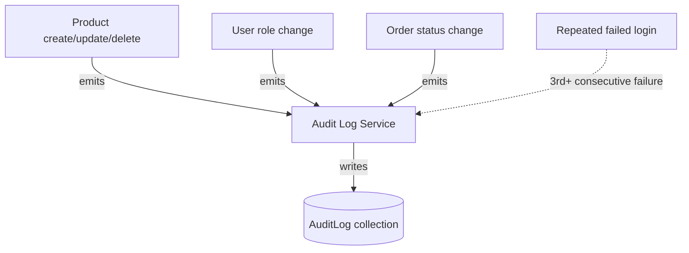

# Graph 05 — Audit Logging Triggers

## Diagram



## Adjacency List

```
NODES: ProductMutation, RoleChange, OrderStatusChange, RepeatedLoginFailure,
       AuditLogService, AuditLogCollection

EDGES:
  ProductMutation       --emits--> AuditLogService
  RoleChange            --emits--> AuditLogService
  OrderStatusChange     --emits--> AuditLogService
  RepeatedLoginFailure  --emits--> AuditLogService   [condition: >=3 consecutive failures, same email]
  AuditLogService        --writes--> AuditLogCollection
```

## Audit entry shape (contract, not just a description)

```
{
  actorId: ObjectId | null,   // null for pre-auth events like login failures
  action: 'product.create' | 'product.update' | 'product.delete'
        | 'user.role_change' | 'order.status_change' | 'auth.repeated_failure',
  targetType: 'Product' | 'User' | 'Order',
  targetId: ObjectId,
  timestamp: ISODate,
  metadata: object   // e.g. { from: 'pending', to: 'shipped' }
}
```

## Agent instructions for this graph

- These are the **only** four trigger nodes in v1 — do not add audit writes to read-only routes (`GET /products`, `GET /cart`) even for completeness; that's log noise, not security value.
- `RepeatedLoginFailure` writes with `actorId: null` since the user isn't authenticated yet — do not attempt to attach a user ID to a failed login attempt.
- Every write to `AuditLogCollection` must go through `AuditLogService` — no route handler should write directly to the `audit_logs` collection.
